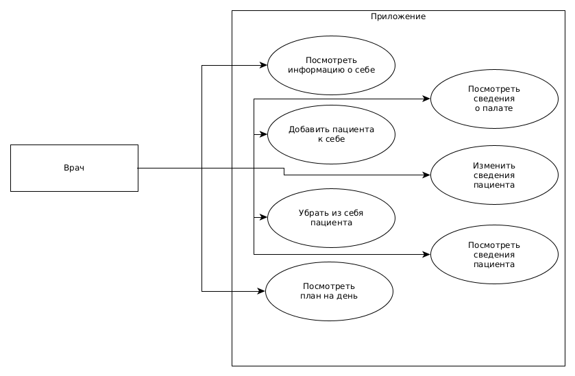
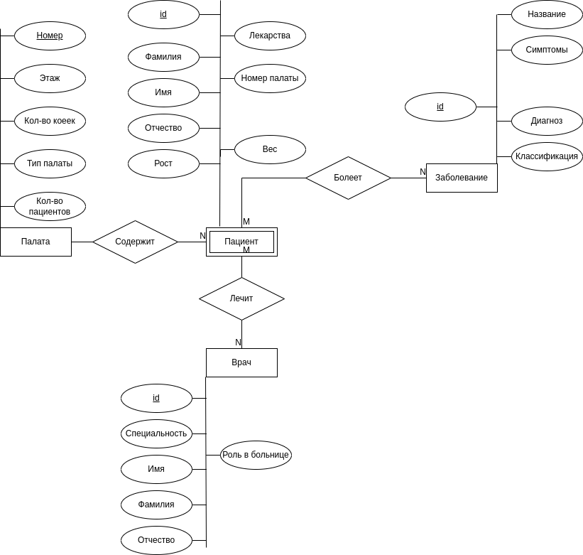
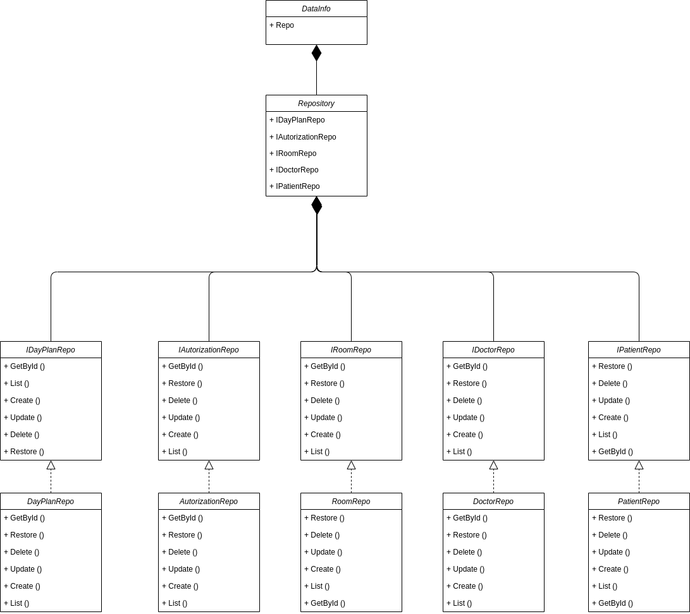

# ППО

## Название

Псих-Админ

## Краткое описание целесообразности и актцальности проекта

Рассмотренные выше решения являются достаточно сложными в использовании, так как предусмотрены для использования в большом количестве мест.
Данный проект предназначен для упрощенного администрирования больницы.
Может быть использовани вместе с альтернативными продуктами.

## Use-Case

## ER

## Описание типа приложения и технологического стека

Приложение **типа** телеграмм бот.

Технологический стек: **Golang**, **PostgreSQL**, **ent**

UML диаграмма бизнес логики: 

UML компонента доступа к данным: 

 
