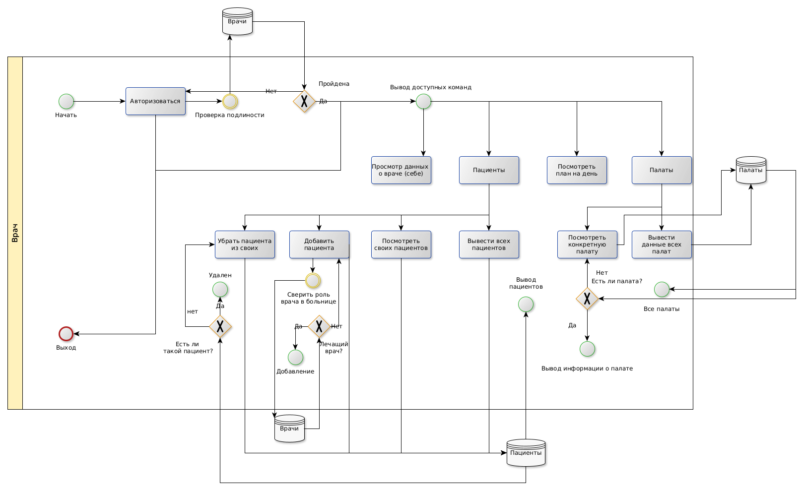

# Лабораторная работа 1

## Название

Псих-Админ

## Краткое описание идеи проекта

Данная система администрирования предназначена для работы с пациентами.
Проект создан для персонала психбольниц.
Данная система будет содержать информацию о пациетах, заболеваниях и лекарствах.

## Краткий анализ аналогичных решений по 3-м критериям

Сущности:

1. Пациенты --- сущность, описывающая пациетов. Основные параметры: ФИО, палата, лечащий врач, болезнь.
2. Врачи --- сущнсть, описывающая врачей. ФИО, специальность, пациенты.
3. Палата --- сущность, описывающая палаты. Номер, этаж, степень опасности.

## Краткий анализ аналогичных решений по 3-м критериям

|Название приложения|Возможность отслеживать пациентов|Отслеживание врачей|Спецификация на психбольницах|Открытость платформы
|-------------------|------------------|---------------|---------------------------|---------------------------|
|1С: Медицина|+|+|-|-|
|Oracle Health Management Platform|-|+|-|-|
|Cerner i.s.h.med|+|+|-|+|

## Краткое описание целесообразности и актцальности проекта

Рассмотренные выше решения являются достаточно сложными в использовании, так как предусмотрены для использования в большом количестве мест.
Данный проект предназначен для упрощенного администрирования больницы.
Может быть использовани вместе с альтернативными продуктами.

## Use-Case

## ER

## Пользовательские сценарии

Пользователь открывает клиент и может:

1. Посмотреть информацию о себе
2. Добавить пациента к себе
3. Перестать быть лечащим врачом пациента
4. Посмотреть план на день
5. Посмотреть сведения о палате
6. Изменить сведения пациента
7. Посмотреть сведения пациента
8. Посмотреть доступные сценарии
9. Авторизация
10. Вывести всех пациентов больници

## Формализация бизнес-правил, BPMN-диаграмма

