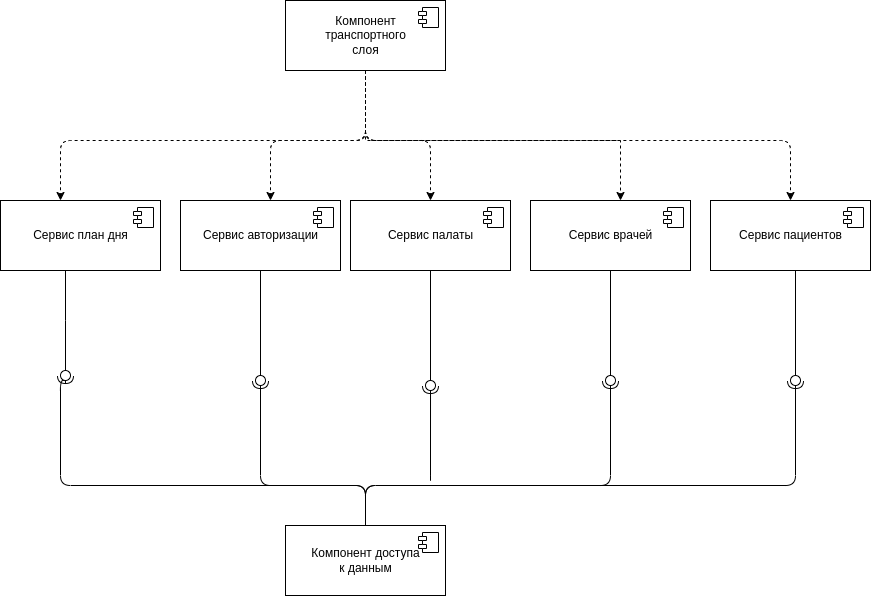
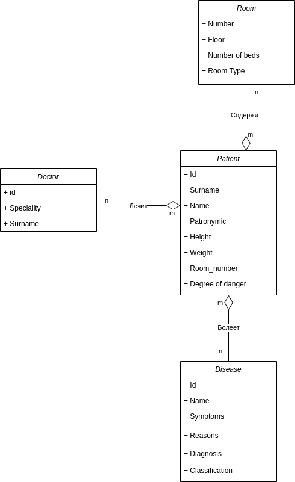
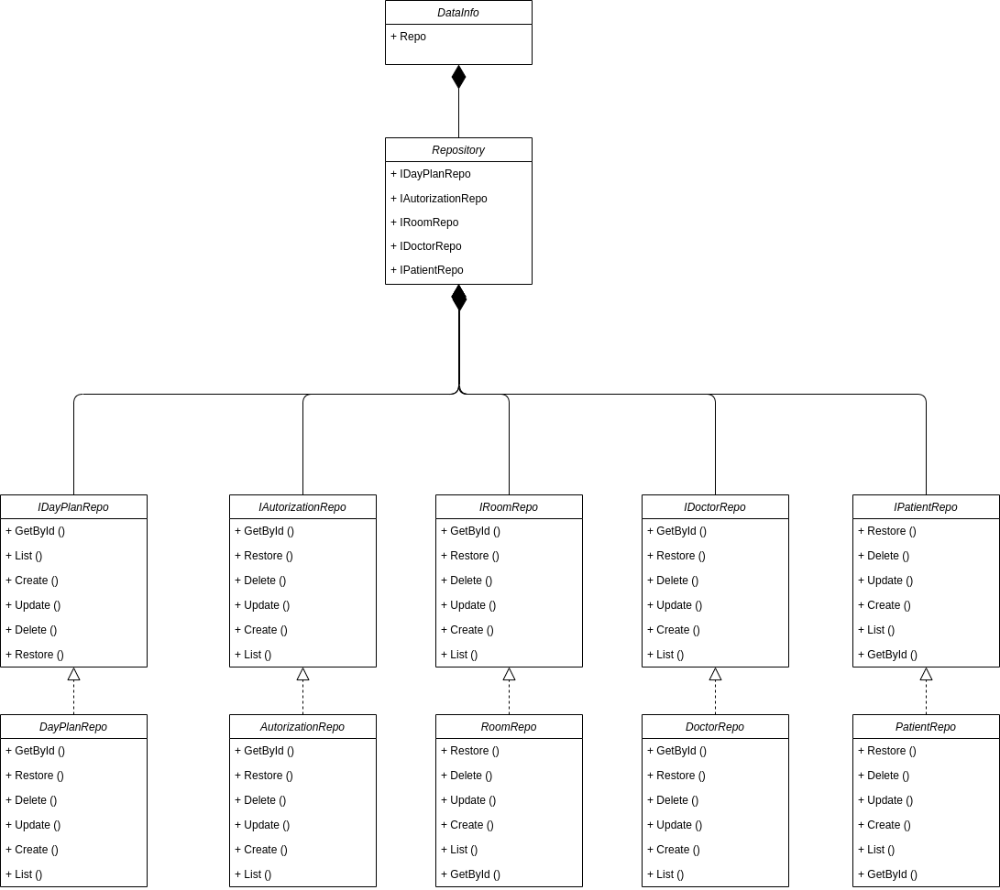

# Лабораторная работа 2

## Описание типа приложения и технологического стека

Приложение **типа** телеграмм бот.

Технологический стек: **Golang**, **PostgreSQL**, **ent**

## Верхнеуровневое разбиение на компоненты

## UML диаграммы классов

UML диаграмма сущностей системы: 

UML диаграмма бизнес логики: 

UML компонента доступа к данным: 

 